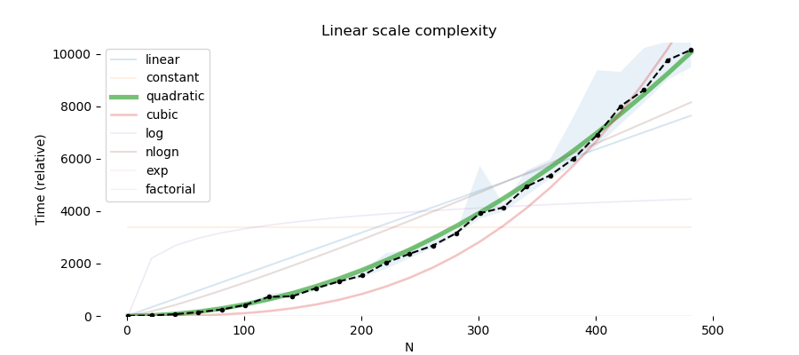

# Time complexity graphs

Simple plots of the time complexity of a function using `timeit`. Runs a function with one parameter `n` a number of times, and 
plots the runtime as a function of `n`. Also fits various standard complexities, and gives a report on the most likely time complexity.


### Example

```python
def quadratic_time(n):
    s = 0
    for i in range(n):
        for j in range(n):
            s = s + 1

complexity_graph(quadratic_time, ns=range(1, 500, 20), reps=12, number=6)
```

#### Output


```
Scores for quadratic_time
  quadratic    42.7%
  nlogn        17.5%
  cubic        13.7%
  linear       13.3%
  log           5.4%
  constant      4.5%
  exp           2.9%
  factorial     0.0%
````
